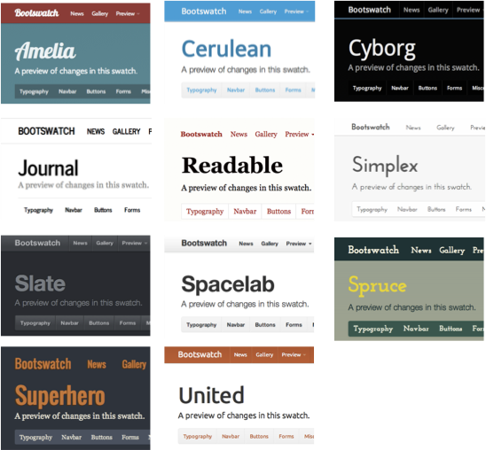

# Html Slides

Simple html sliding system based on [strapdown.js](http://strapdownjs.com).

### Fast slides

Create slides quickly by editing `index.html` and adding more `<slide>` elements.

Content of every `<md>` element or element with css class `md` is parsed as markdown.

### Available themes

### Credits

All credit goes to the projects below:
+ [Strapdown.js](http://strapdownjs.com) - Instant and elegant Markdown documents (uses all below)
+ [Marked](https://github.com/chjj/marked/) - Fast Markdown parser in JavaScript
+ [Google Code Prettify](http://code.google.com/p/google-code-prettify/) - Syntax highlighting in JavaScript
+ [Twitter Bootstrap](http://twitter.github.com/bootstrap/) - Beautiful, responsive CSS framework
+ [Bootswatch](http://bootswatch.com) - Additional Bootstrap themes
